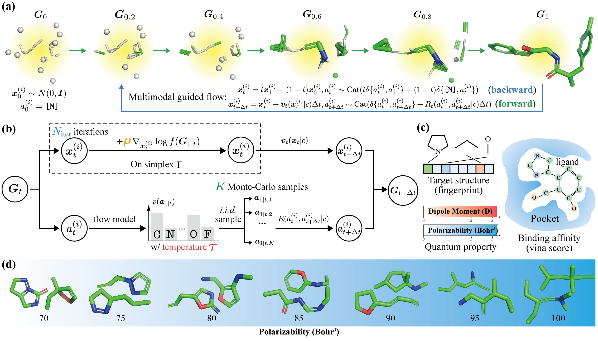

# TFG-FLOW: Training-Free Guidance in Multi-Modal Generative Flow

[](https://iclr.cc/)
[](LICENSE)

Official implementation for the ICLR 2025 paper **"TFG-Flow: Training-Free Guidance in Multi-Modal Generative Flow"** by Haowei Lin, Shanda Li, Haotian Ye, Yiming Yang, Stefano Ermon, Yitao Liang, Jianzhu Ma.

 <!-- Replace with actual figure path -->

## 📌 Overview

This repository contains:

- ✅ Training-free guidance framework for multi-modal generative flows
- ✅ Implementation for quantum chemistry (QM9) property guidance
- ✅ Scripts for training:
  - Multi-modal flow models (`scripts/train_flow.sh`)
  - Guidance target predictors (`scripts/train_guide_clf.sh`)
  - Oracle target predictors (`scripts/train_oracle.sh`)

## 🚀 Quick Start

### Installation
```bash
git clone https://github.com/linhaowei1/tfg-flow.git
cd tfg-flow
pip install -r requirements.txt

# Install PyTorch (example - modify for your cuda version)
conda install pytorch torchvision torchaudio pytorch-cuda=12.1 -c pytorch -c nvidia
```

## 🧠 Model Training

### 1. Train Base Flow Model
```bash
bash scripts/train_flow.sh
```

### 2. Train Guidance Classifier
```bash
bash scripts/train_guide_clf.sh
```

### 3. Train Oracle Model
```bash
bash scripts/train_oracle.sh
```

## 4 Inference with Guidance
```bash
for property in alpha cv gap homo lumo mu;
do
    bash scripts/qm9/guidance/qm9_$property.sh
done
```

Notice that the results of homo, lumo, and gap are for Hartree. If you'd like to get meV results, please convert them using `1 Hartree = 27,211.4 meV`.

## 🤝 Contributing
Contributions welcome! Please open an issue or PR for suggestions/improvements.

## 📧 Contact
For questions, contact linhaowei@pku.edu.cn or open an issue.

## 📖 Citation
```bibtex
@inproceedings{tfgflow2025,
  title={TFG-Flow: Training-Free Guidance in Multi-Modal Generative Flow},
  author={Lin, Haowei and Li, Shanda and Ye, Haotian and Yang, Yiming and Ermon, Stefano and Liang, Yitao and Ma, Jianzhu},
  booktitle={International Conference on Learning Representations (ICLR)},
  year={2025}
}
```